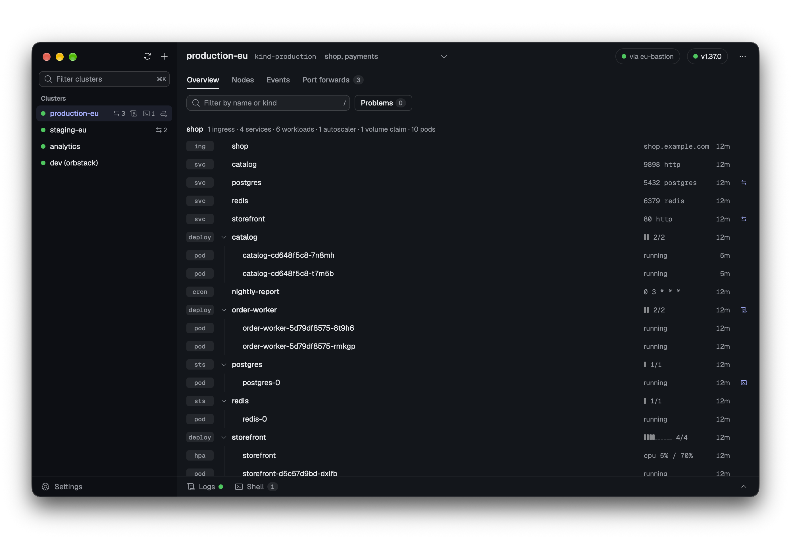
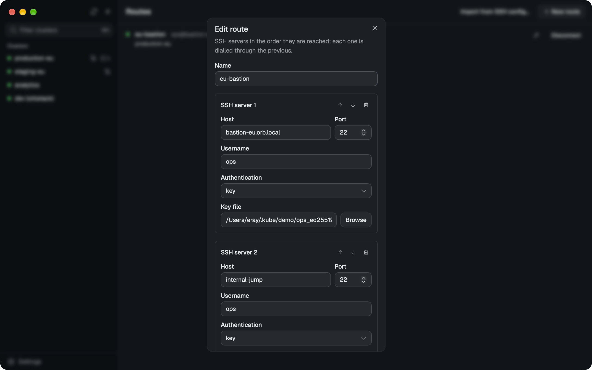
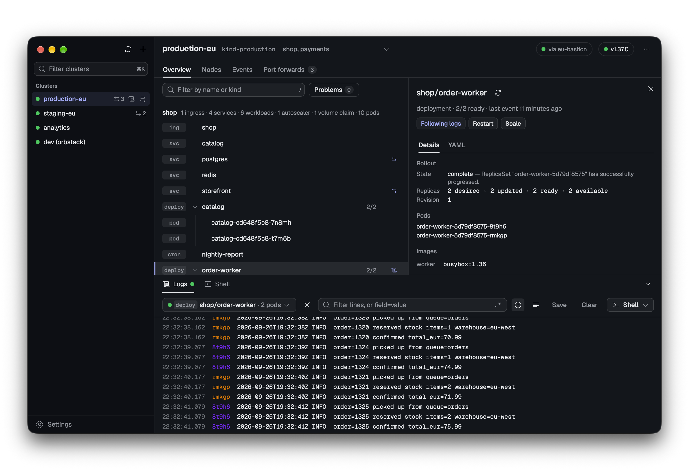
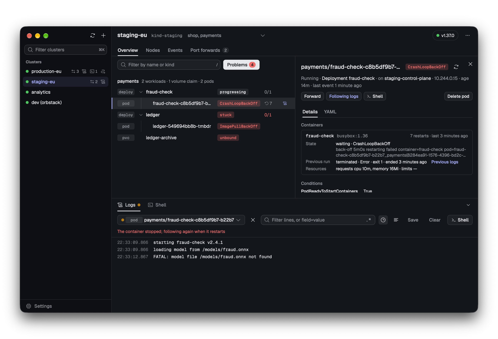
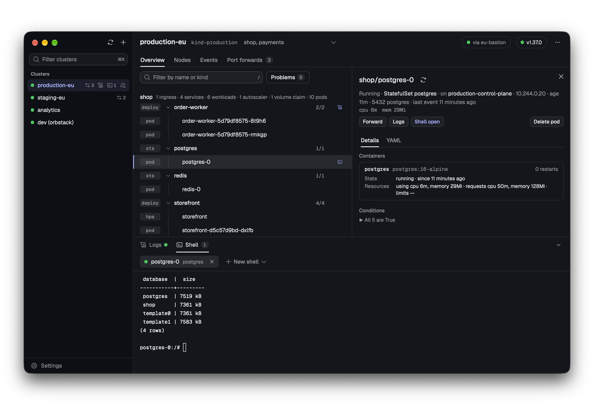
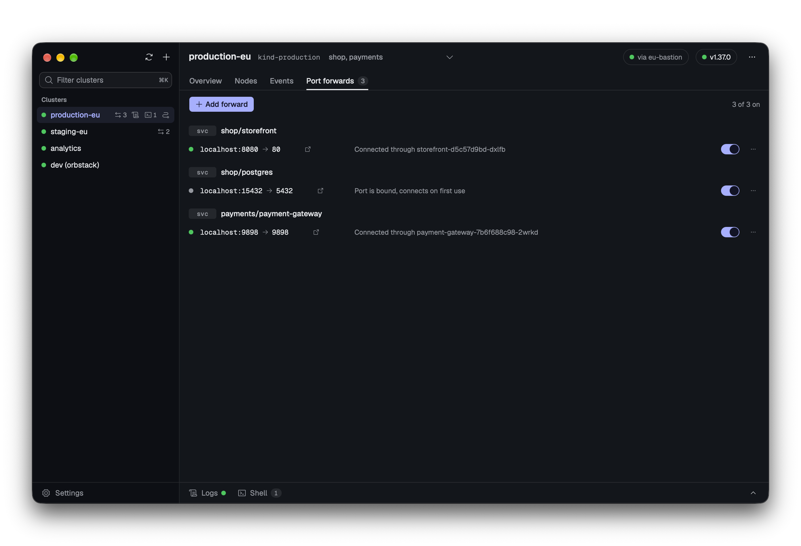

# Kubereach

A Kubernetes desktop app that can connect to clusters through SSH jump hosts.

> Kubereach is early (v0.3). Expect rough edges, and please [open an issue](https://github.com/edereagzi/kubereach/issues) when you hit one.



## What it does

- Reaches clusters directly or through a Route: one or more SSH servers, each dialled through the previous one.
- An overview of each namespace: pods under the workload that runs them with its ready count, Jobs, volume claims and autoscalers, and a Problems filter.
- Follows logs from a single pod or from every pod of a workload, with filtering.
- Opens shells in containers.
- Shows events, and pod diagnosis: container states, restarts, previous-run logs and failing conditions.
- Rollouts: restart and scale workloads, roll back deployments.
- Saved port-forwards that keep their local port and reconnect on their own.
- A tray menu with what is running and its forwards.

## What it doesn't do

- No account and no telemetry.
- Nothing is installed in the cluster.
- Passwords and key passphrases are never written to disk; they are kept in memory for the session.
- At launch it asks GitHub whether a newer release is out. That is the only request it makes on its own, and it can be turned off in Settings with "Check for updates".

## Screenshots

| | |
|---|---|
|  |  |
| Routes: the SSH servers a cluster is reached through | Logs from every pod of a workload |
|  |  |
| Pod diagnosis | Shells |
|  | |
| Saved port-forwards | |

## Install

macOS and Linux:

```sh
curl -fsSL https://raw.githubusercontent.com/edereagzi/kubereach/main/install.sh | sh
```

Windows (PowerShell):

```powershell
irm https://raw.githubusercontent.com/edereagzi/kubereach/main/install.ps1 | iex
```

Or download a build from the [latest release](https://github.com/edereagzi/kubereach/releases/latest):

| OS | File |
|---|---|
| macOS (Apple silicon and Intel) | `kubereach_darwin_universal.zip` |
| Windows | `kubereach_windows_amd64_installer.exe` or `kubereach_windows_amd64.zip` |
| Linux x86-64 | `kubereach_linux_amd64.tar.gz` |
| Linux ARM64 | `kubereach_linux_arm64.tar.gz` |

On Linux, Kubereach needs GTK 4 and WebKitGTK 6.0 (Ubuntu 24.04 and later: `sudo apt install libwebkitgtk-6.0-4`).

### Opening an unsigned build

Builds are not signed yet, so the OS warns the first time you open a downloaded one. The install scripts above avoid these warnings.

- **macOS:** open System Settings → Privacy & Security and click **Open Anyway**, or run `xattr -dr com.apple.quarantine /Applications/Kubereach.app`.
- **Windows:** on the SmartScreen prompt, click **More info** → **Run anyway**.
- **Linux:** no warning; make the binary executable if needed (`chmod +x kubereach`).

## Tested on

- macOS (Apple silicon)
- Windows 11
- Ubuntu 26.04 LTS (GNOME)

Other platforms may work but are not tested yet.

## Known limitations

- GNOME shows no tray icon without the [AppIndicator extension](https://extensions.gnome.org/extension/615/appindicator-support/). Closing the window hides it; launch Kubereach again to bring it back, and quit with Ctrl+Q.
- Builds are unsigned (see above).

## Building from source

Requires Go, Node.js with pnpm, and the [Wails v3 CLI](https://github.com/wailsapp/wails) (run `go install github.com/wailsapp/wails/v3/cmd/wails3` in the repository to get the version it uses).

```sh
wails3 dev     # run with live reload
wails3 build   # build into bin/
```

See [CONTRIBUTING.md](CONTRIBUTING.md) to send a change.

## License

[Apache-2.0](LICENSE)
